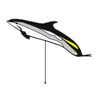
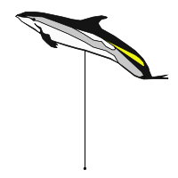
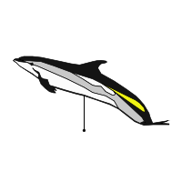
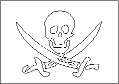

.. _symbols_gallery:

Users Symbol Contributions
==========================
 
.. toctree::
   :hidden:

   gallery/users_contrib_symbols/atlantwhitesided.rst
   gallery/users_contrib_symbols/atlantwhitesided_high.rst
   gallery/users_contrib_symbols/atlantwhitesided_low.rst
   gallery/users_contrib_symbols/pirata.rst

Biology symbols
---------------

These are symbols used to illustrate sightings of whales.

+------------------------------------+--------------------------------------+---------------------------------------+
| :ref:`atlantwhitesided.rst`        | :ref:`atlantwhitesided_high.rst`     | :ref:`atlantwhitesided_low.rst`       |
|                                    |                                      |                                       |
| |C001|                             | |C002|                               | |C003|                                |
+------------------------------------+--------------------------------------+---------------------------------------+

Miscellaneous symbols
---------------------

These are general-purpose symbols you may find useful.

+-----------------+----------------+
| :ref:`pirata`   |                |
|                 |                |
| |0001|          |                |
+-----------------+----------------+

