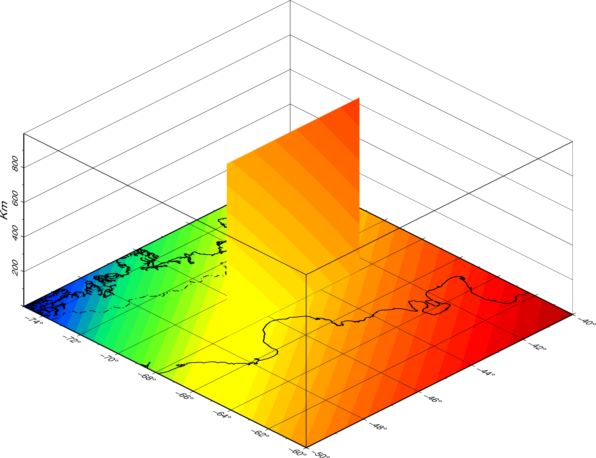

.. _vertical-slice:

A Vertical slice
----------------

This is an example of how to graph a function p=f(x, y, z)
and include in the graph a slice of it using GMT.

In this case, my function is f(latitude, longitude, height) and to make
the example self-contained I make the grid and the slice in the script.

To keep the example easy to me, I did the slice in a N-S direction at a
fixed longitude, so the slice is f(latitude, height). Nothing will prevent
you from making the slices in other orientations. If you instead of a more
or less straight line, you have an arbitrary path, you must be careful that
the track does not have "folds" and if it has them you must break it into parts.

Due to my slice is f(lat, height) I must dump it, add the column for the fixed
longitude, and project the coordinates using mappproject and then re-grid it.

The biggest problem that I found, and it took longer to me was how to locate
the slice. In a 2D map it is easy to do, transforming (lat, lon) to (x, y) with
mapproject, and then using J[xX] but in this case it was trial and error for me.
Maybe someone has the recipe to do it analytically.

The grid in the horizontal plane is to make sure the slice is located exactly where it should be.

I also had to re-draw the box, because the slice partially covered it.

I tried to make the script as clear as possible with comments, but
yet they can be tricky.

Regards, Eduardo.-

--
Eduardo A. Suarez
Facultad de Ciencias Astronomicas y Geofisicas - UNLP

.. code-block:: bash

 #!/bin/bash
 x_min=-75
 x_max=-60
 y_min=-50
 y_max=-40
 lon=-68
 lat=-45
 R="$x_min/$x_max/$y_min/$y_max"
 J="M$lon/$lat/16"
 z_scale=8
 gmt begin vertical-slice png
 gmt set MAP_FRAME_TYPE plain
 #
 #  f(x,y,z) = sin(x+y)*e(-(x+y)*(3 - (z/1e4)))
 #
 # create base grid (z = 0)
 #
 gmt grdmath -R$R -I0.005 X D2R Y D2R ADD STO@xySum SIN @xySum 3 MUL NEG EXP MUL = base.nc
 #
 # create slice grid (lon = $lon) (-47.5 <= lat <= -42.5)  (0 <= z <= 999)
 #
 gmt grdmath -R-47.5/-42.5/0/999 -I0.005/0.5 X D2R $lon D2R ADD STO@xySum SIN @xySum 3 Y 1E4 DIV SUB MUL NEG EXP MUL = slice.nc
 #
 # dump slice grid and reproject X
 #
 gmt grd2xyz slice.nc | awk "{print $lon,\$0}" | gmt mapproject -R$R -J$J | awk '{print $2,$3,$4}'> points.txt
 #
 # calculate projected region X-limits
 #
 lMin=`echo "$lon -47.5" | gmt mapproject -R$R -J$J | awk '{print $2}'`
 lMax=`echo "$lon -42.5" | gmt mapproject -R$R -J$J | awk '{print $2}'`
 #
 # re-grid slice
 #
 gmt surface points.txt -Gslice_cut.nc -R$lMin/$lMax/0/999 -I1500+/2000+ -C0.1 -T0.25
 #
 # create CPT
 #
 deltaZ=`gmt grdinfo -T10 slice_cut.nc base.nc`
 gmt makecpt -Cseis -I $deltaZ
 #
 # plot base grid (z = 0)
 #
 gmt grdimage base.nc -R$R/0/999 -J$J -JZ$z_scale -Bafg -Bzafg+l"Km" -BwESnZ+b -pz135/30+v10/5
 #
 # plot map (coast, country borders). Grid plotted to check slice location
 #
 gmt coast -Df -A5000 -N1/1p,black,.- -W1p,black -p
 #
 # calculate max X projected
 #
 xMax=`echo "$x_max $y_max" | gmt mapproject -R$R -J$J | awk '{print $2}'`
 #
 # plot slice
 #
 gmt grdimage slice_cut.nc -R0/$xMax/0/999 -JX$xMax/$z_scale -px135/30+v12.59/0.96
 gmt plot3d -R$R/0/999 -J$J -JZ$z_scale -W0.5p -pz135/30+v10/5 -A << EOF
 $x_min $y_min 999
 $x_max $y_min 999
 $x_max $y_max 999
 >
 $x_max $y_min 0
 $x_max $y_min 999
 EOF
 gmt end show
 rm base.nc points.txt slice.nc slice_cut.nc

   A vertical slice ...
