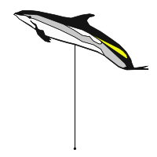
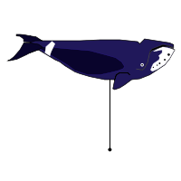
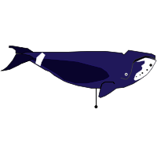
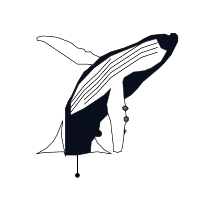
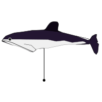
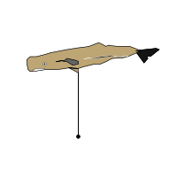

.. _symbols_gallery:

Users Symbol Contributions
==========================

Biology symbols
---------------

.. toctree::
   :maxdepth: 1

   gallery/users_contrib_symbols/Cetacea.rst

These are symbols used to illustrate sightings of whales.

+-------------------------------------+-------------------------------------+-------------------------------------+
| :ref:`atlantwhitesided`             | :ref:`atlantwhitesided_high`        | :ref:`atlantwhitesided_low`         |
|                                     |                                     |                                     |
| |C001|                              | |C002|                              | |C003|                              |
+-------------------------------------+-------------------------------------+-------------------------------------+
| :ref:`beluga`                       | :ref:`beluga_high`                  | :ref:`beluga_low`                   |
|                                     |                                     |                                     |
| |C004|                              | |C005|                              | |C006|                              |
+-------------------------------------+-------------------------------------+-------------------------------------+
| :ref:`bottlenose`                   | :ref:`bottlenose_high`              | :ref:`bottlenose_low`               |
|                                     |                                     |                                     |
| |C007|                              | |C008|                              | |C009|                              |
+-------------------------------------+-------------------------------------+-------------------------------------+
| :ref:`bowhead`                      | :ref:`bowhead_high`                 | :ref:`bowhead_low`                  |
|                                     |                                     |                                     |
| |C010|                              | |C011|                              | |C012|                              |
+-------------------------------------+-------------------------------------+-------------------------------------+
| :ref:`burmeistersporpoise`          | :ref:`burmeistersporpoise_high`     | :ref:`burmeistersporpoise_low`      |
|                                     |                                     |                                     |
| |C013|                              | |C014|                              | |C015|                              |
+-------------------------------------+-------------------------------------+-------------------------------------+
| :ref:`commondolphin`                | :ref:`commondolphin_high`           | :ref:`commondolphin_low`            |
|                                     |                                     |                                     |
| |C016|                              | |C017|                              | |C018|                              |
+-------------------------------------+-------------------------------------+-------------------------------------+
| :ref:`commondolphin_midhigh`        | :ref:`commondolphin_midlow`         | :ref:`commonporpoise`               |
|                                     |                                     |                                     |
| |C019|                              | |C020|                              | |C021|                              |
+-------------------------------------+-------------------------------------+-------------------------------------+
| :ref:`commonporpoise_high`          | :ref:`commonporpoise_low`           | :ref:`cuviersbeaked`                |
|                                     |                                     |                                     |
| |C022|                              | |C023|                              | |C024|                              |
+-------------------------------------+-------------------------------------+-------------------------------------+
| :ref:`cuviersbeaked_high`           | :ref:`cuviersbeaked_low`            | :ref:`finwhale`                     |
|                                     |                                     |                                     |
| |C025|                              | |C026|                              | |C027|                              |
+-------------------------------------+-------------------------------------+-------------------------------------+
| :ref:`finwhale_high`                | :ref:`finwhale_low`                 | :ref:`graywhale`                    |
|                                     |                                     |                                     |
| |C028|                              | |C029|                              | |C030|                              |
+-------------------------------------+-------------------------------------+-------------------------------------+
| :ref:`graywhale_high`               | :ref:`graywhale_low`                | :ref:`humpbacktail_one`             |
|                                     |                                     |                                     |
| |C031|                              | |C032|                              | |C033|                              |
+-------------------------------------+-------------------------------------+-------------------------------------+
| :ref:`humpbacktail_one_low`         | :ref:`humpbacktail_two`             | :ref:`humpbacktail_two_low`         |
|                                     |                                     |                                     |
| |C034|                              | |C035|                              | |C036|                              |
+-------------------------------------+-------------------------------------+-------------------------------------+
| :ref:`jumpback`                     | :ref:`jumpback_high`                | :ref:`jumpback_low`                 |
|                                     |                                     |                                     |
| |C037|                              | |C038|                              | |C039|                              |
+-------------------------------------+-------------------------------------+-------------------------------------+
| :ref:`killerwhale`                  | :ref:`killerwhale_high`             | :ref:`killerwhale_low`              |
|                                     |                                     |                                     |
| |C040|                              | |C041|                              | |C042|                              |
+-------------------------------------+-------------------------------------+-------------------------------------+
| :ref:`longfinnedpilotwhale`         | :ref:`longfinnedpilotwhale_high`    | :ref:`longfinnedpilotwhale_low`     |
|                                     |                                     |                                     |
| |C043|                              | |C044|                              | |C045|                              |
+-------------------------------------+-------------------------------------+-------------------------------------+
| :ref:`minkewhale`                   | :ref:`minkewhale_high`              | :ref:`minkewhale_low`               |
|                                     |                                     |                                     |
| |C046|                              | |C047|                              | |C048|                              |
+-------------------------------------+-------------------------------------+-------------------------------------+
| :ref:`northernrightwhale`           | :ref:`northernrightwhale_high`      | :ref:`northernrightwhale_low`       |
|                                     |                                     |                                     |
| |C049|                              | |C050|                              | |C051|                              |
+-------------------------------------+-------------------------------------+-------------------------------------+
| :ref:`pigmyspermwhale`              | :ref:`pigmyspermwhale_high`         | :ref:`pigmyspermwhale_low`          |
|                                     |                                     |                                     |
| |C052|                              | |C053|                              | |C054|                              |
+-------------------------------------+-------------------------------------+-------------------------------------+
| :ref:`rissosdolphin`                | :ref:`rissosdolphin_high`           | :ref:`rissosdolphin_low`            |
|                                     |                                     |                                     |
| |C055|                              | |C056|                              | |C057|                              |
+-------------------------------------+-------------------------------------+-------------------------------------+
| :ref:`seiwhale`                     | :ref:`seiwhale_high`                | :ref:`seiwhale_low`                 |
|                                     |                                     |                                     |
| |C058|                              | |C059|                              | |C060|                              |
+-------------------------------------+-------------------------------------+-------------------------------------+
| :ref:`shortfinnedpilotwhale`        | :ref:`shortfinnedpilotwhale_high`   | :ref:`shortfinnedpilotwhale_low`    |
|                                     |                                     |                                     |
| |C061|                              | |C062|                              | |C063|                              |
+-------------------------------------+-------------------------------------+-------------------------------------+
| :ref:`southernrightwhale`           | :ref:`southernrightwhale_high`      | :ref:`southernrightwhale_low`       |
|                                     |                                     |                                     |
| |C064|                              | |C065|                              | |C066|                              |
+-------------------------------------+-------------------------------------+-------------------------------------+
| :ref:`spectacledporpoise`           | :ref:`spectacledporpoise_high`      | :ref:`spectacledporpoise_low`       |
|                                     |                                     |                                     |
| |C067|                              | |C068|                              | |C069|                              |
+-------------------------------------+-------------------------------------+-------------------------------------+
| :ref:`spermwhale`                   | :ref:`spermwhale_high`              | :ref:`spermwhale_low`               |
|                                     |                                     |                                     |
| |C070|                              | |C071|                              | |C072|                              |
+-------------------------------------+-------------------------------------+-------------------------------------+
| :ref:`spermwhaletail`               | :ref:`spermwhaletail_high`          | :ref:`spermwhaletail_low`           |
|                                     |                                     |                                     |
| |C073|                              | |C074|                              | |C075|                              |
+-------------------------------------+-------------------------------------+-------------------------------------+
| :ref:`srightwhaledolphin`           | :ref:`srightwhaledolphin_high`      | :ref:`srightwhaledolphin_low`       |
|                                     |                                     |                                     |
| |C076|                              | |C077|                              | |C078|                              |
+-------------------------------------+-------------------------------------+-------------------------------------+
| :ref:`stripeddolphin`               | :ref:`stripeddolphin_high`          | :ref:`stripeddolphin_low`           |
|                                     |                                     |                                     |
| |C079|                              | |C080|                              | |C081|                              |
+-------------------------------------+-------------------------------------+-------------------------------------+
| :ref:`unidentifiedbeakedwhale`      | :ref:`unidentifiedbeakedwhale_high` | :ref:`unidentifiedbeakedwhale_low`  |
|                                     |                                     |                                     |
| |C082|                              | |C083|                              | |C084|                              |
+-------------------------------------+-------------------------------------+-------------------------------------+
| :ref:`unidentifieddolphin`          | :ref:`unidentifieddolphin_high`     | :ref:`unidentifieddolphin_low`      |
|                                     |                                     |                                     |
| |C085|                              | |C086|                              | |C087|                              |
+-------------------------------------+-------------------------------------+-------------------------------------+
| :ref:`unidentifiedwhale`            | :ref:`unidentifiedwhale_high`       | :ref:`unidentifiedwhale_low`        |
|                                     |                                     |                                     |
| |C088|                              | |C089|                              | |C090|                              |
+-------------------------------------+-------------------------------------+-------------------------------------+

.. |C001| image:: gallery/users_contrib_symbols/images/atlantwhitesided.png
    :width: 150

.. |C003| image:: gallery/users_contrib_symbols/images/atlantwhitesided_low.png
    :width: 150

.. |C004| image:: gallery/users_contrib_symbols/images/beluga.png
    :width: 150

.. |C005| image:: gallery/users_contrib_symbols/images/beluga_high.png
    :width: 150

.. |C006| image:: gallery/users_contrib_symbols/images/beluga_low.png
    :width: 150

.. |C007| image:: gallery/users_contrib_symbols/images/bottlenose.png
    :width: 150

.. |C008| image:: gallery/users_contrib_symbols/images/bottlenose_high.png
    :width: 150

.. |C009| image:: gallery/users_contrib_symbols/images/bottlenose_low.png
    :width: 150

.. |C011| image:: gallery/users_contrib_symbols/images/bowhead_high.png
    :width: 150

.. |C013| image:: gallery/users_contrib_symbols/images/burmeistersporpoise.png
    :width: 150

.. |C014| image:: gallery/users_contrib_symbols/images/burmeistersporpoise_high.png
    :width: 150

.. |C015| image:: gallery/users_contrib_symbols/images/burmeistersporpoise_low.png
    :width: 150

.. |C016| image:: gallery/users_contrib_symbols/images/commondolphin.png
    :width: 150

.. |C017| image:: gallery/users_contrib_symbols/images/commondolphin_high.png
    :width: 150

.. |C018| image:: gallery/users_contrib_symbols/images/commondolphin_low.png
    :width: 150

.. |C019| image:: gallery/users_contrib_symbols/images/commondolphin_midhigh.png
    :width: 150

.. |C020| image:: gallery/users_contrib_symbols/images/commondolphin_midlow.png
    :width: 150

.. |C021| image:: gallery/users_contrib_symbols/images/commonporpoise.png
    :width: 150

.. |C022| image:: gallery/users_contrib_symbols/images/commonporpoise_high.png
    :width: 150

.. |C023| image:: gallery/users_contrib_symbols/images/commonporpoise_low.png
    :width: 150

.. |C024| image:: gallery/users_contrib_symbols/images/cuviersbeaked.png
    :width: 150

.. |C025| image:: gallery/users_contrib_symbols/images/cuviersbeaked_high.png
    :width: 150

.. |C026| image:: gallery/users_contrib_symbols/images/cuviersbeaked_low.png
    :width: 150

.. |C027| image:: gallery/users_contrib_symbols/images/finwhale.png
    :width: 150

.. |C028| image:: gallery/users_contrib_symbols/images/finwhale_high.png
    :width: 150

.. |C029| image:: gallery/users_contrib_symbols/images/finwhale_low.png
    :width: 150

.. |C030| image:: gallery/users_contrib_symbols/images/graywhale.png
    :width: 150

.. |C031| image:: gallery/users_contrib_symbols/images/graywhale_high.png
    :width: 150

.. |C032| image:: gallery/users_contrib_symbols/images/graywhale_low.png
    :width: 150

.. |C033| image:: gallery/users_contrib_symbols/images/humpbacktail_one.png
    :width: 150

.. |C034| image:: gallery/users_contrib_symbols/images/humpbacktail_one_low.png
    :width: 150

.. |C035| image:: gallery/users_contrib_symbols/images/humpbacktail_two.png
    :width: 150

.. |C036| image:: gallery/users_contrib_symbols/images/humpbacktail_two_low.png
    :width: 150

.. |C037| image:: gallery/users_contrib_symbols/images/jumpback.png
    :width: 150

.. |C038| image:: gallery/users_contrib_symbols/images/jumpback_high.png
    :width: 150

.. |C040| image:: gallery/users_contrib_symbols/images/killerwhale.png
    :width: 150

.. |C041| image:: gallery/users_contrib_symbols/images/killerwhale_high.png
    :width: 150

.. |C042| image:: gallery/users_contrib_symbols/images/killerwhale_low.png
    :width: 150

.. |C043| image:: gallery/users_contrib_symbols/images/longfinnedpilotwhale.png
    :width: 150

.. |C044| image:: gallery/users_contrib_symbols/images/longfinnedpilotwhale_high.png
    :width: 150

.. |C045| image:: gallery/users_contrib_symbols/images/longfinnedpilotwhale_low.png
    :width: 150

.. |C046| image:: gallery/users_contrib_symbols/images/minkewhale.png
    :width: 150

.. |C047| image:: gallery/users_contrib_symbols/images/minkewhale_high.png
    :width: 150

.. |C048| image:: gallery/users_contrib_symbols/images/minkewhale_low.png
    :width: 150

.. |C049| image:: gallery/users_contrib_symbols/images/northernrightwhale.png
    :width: 150

.. |C050| image:: gallery/users_contrib_symbols/images/northernrightwhale_high.png
    :width: 150

.. |C051| image:: gallery/users_contrib_symbols/images/northernrightwhale_low.png
    :width: 150

.. |C052| image:: gallery/users_contrib_symbols/images/pigmyspermwhale.png
    :width: 150

.. |C053| image:: gallery/users_contrib_symbols/images/pigmyspermwhale_high.png
    :width: 150

.. |C054| image:: gallery/users_contrib_symbols/images/pigmyspermwhale_low.png
    :width: 150

.. |C055| image:: gallery/users_contrib_symbols/images/rissosdolphin.png
    :width: 150

.. |C056| image:: gallery/users_contrib_symbols/images/rissosdolphin_high.png
    :width: 150

.. |C057| image:: gallery/users_contrib_symbols/images/rissosdolphin_low.png
    :width: 150

.. |C058| image:: gallery/users_contrib_symbols/images/seiwhale.png
    :width: 150

.. |C059| image:: gallery/users_contrib_symbols/images/seiwhale_high.png
    :width: 150

.. |C060| image:: gallery/users_contrib_symbols/images/seiwhale_low.png
    :width: 150

.. |C061| image:: gallery/users_contrib_symbols/images/shortfinnedpilotwhale.png
    :width: 150

.. |C062| image:: gallery/users_contrib_symbols/images/shortfinnedpilotwhale_high.png
    :width: 150

.. |C063| image:: gallery/users_contrib_symbols/images/shortfinnedpilotwhale_low.png
    :width: 150

.. |C064| image:: gallery/users_contrib_symbols/images/southernrightwhale.png
    :width: 150

.. |C065| image:: gallery/users_contrib_symbols/images/southernrightwhale_high.png
    :width: 150

.. |C066| image:: gallery/users_contrib_symbols/images/southernrightwhale_low.png
    :width: 150

.. |C067| image:: gallery/users_contrib_symbols/images/spectacledporpoise.png
    :width: 150

.. |C068| image:: gallery/users_contrib_symbols/images/spectacledporpoise_high.png
    :width: 150

.. |C071| image:: gallery/users_contrib_symbols/images/spermwhale_high.png
    :width: 150

.. |C072| image:: gallery/users_contrib_symbols/images/spermwhale_low.png
    :width: 150

.. |C073| image:: gallery/users_contrib_symbols/images/spermwhaletail.png
    :width: 150

.. |C074| image:: gallery/users_contrib_symbols/images/spermwhaletail_high.png
    :width: 150

.. |C075| image:: gallery/users_contrib_symbols/images/spermwhaletail_low.png
    :width: 150

.. |C076| image:: gallery/users_contrib_symbols/images/srightwhaledolphin.png
    :width: 150

.. |C077| image:: gallery/users_contrib_symbols/images/srightwhaledolphin_high.png
    :width: 150

.. |C078| image:: gallery/users_contrib_symbols/images/srightwhaledolphin_low.png
    :width: 150

.. |C079| image:: gallery/users_contrib_symbols/images/stripeddolphin.png
    :width: 150

.. |C080| image:: gallery/users_contrib_symbols/images/stripeddolphin_high.png
    :width: 150

.. |C081| image:: gallery/users_contrib_symbols/images/stripeddolphin_low.png
    :width: 150

.. |C082| image:: gallery/users_contrib_symbols/images/unidentifiedbeakedwhale.png
    :width: 150

.. |C083| image:: gallery/users_contrib_symbols/images/unidentifiedbeakedwhale_high.png
    :width: 150

.. |C084| image:: gallery/users_contrib_symbols/images/unidentifiedbeakedwhale_low.png
    :width: 150

.. |C085| image:: gallery/users_contrib_symbols/images/unidentifieddolphin.png
    :width: 150

.. |C086| image:: gallery/users_contrib_symbols/images/unidentifieddolphin_high.png
    :width: 150

.. |C087| image:: gallery/users_contrib_symbols/images/unidentifieddolphin_low.png
    :width: 150

.. |C088| image:: gallery/users_contrib_symbols/images/unidentifiedwhale.png
    :width: 150

.. |C089| image:: gallery/users_contrib_symbols/images/unidentifiedwhale_high.png
    :width: 150

.. |C090| image:: gallery/users_contrib_symbols/images/unidentifiedwhale_low.png
	:width: 150

.. toctree::
   :hidden:

   gallery/users_contrib_symbols/atlantwhitesided.rst
   gallery/users_contrib_symbols/atlantwhitesided_high.rst
   gallery/users_contrib_symbols/atlantwhitesided_low.rst
   gallery/users_contrib_symbols/beluga.rst
   gallery/users_contrib_symbols/beluga_high.rst
   gallery/users_contrib_symbols/beluga_low.rst
   gallery/users_contrib_symbols/bottlenose.rst
   gallery/users_contrib_symbols/bottlenose_high.rst
   gallery/users_contrib_symbols/bottlenose_low.rst
   gallery/users_contrib_symbols/bowhead.rst
   gallery/users_contrib_symbols/bowhead_high.rst
   gallery/users_contrib_symbols/bowhead_low.rst
   gallery/users_contrib_symbols/burmeistersporpoise.rst
   gallery/users_contrib_symbols/burmeistersporpoise_high.rst
   gallery/users_contrib_symbols/burmeistersporpoise_low.rst
   gallery/users_contrib_symbols/commondolphin.rst
   gallery/users_contrib_symbols/commondolphin_high.rst
   gallery/users_contrib_symbols/commondolphin_low.rst
   gallery/users_contrib_symbols/commondolphin_midhigh.rst
   gallery/users_contrib_symbols/commondolphin_midlow.rst
   gallery/users_contrib_symbols/commonporpoise.rst
   gallery/users_contrib_symbols/commonporpoise_high.rst
   gallery/users_contrib_symbols/commonporpoise_low.rst
   gallery/users_contrib_symbols/cuviersbeaked.rst
   gallery/users_contrib_symbols/cuviersbeaked_high.rst
   gallery/users_contrib_symbols/cuviersbeaked_low.rst
   gallery/users_contrib_symbols/finwhale.rst
   gallery/users_contrib_symbols/finwhale_high.rst
   gallery/users_contrib_symbols/finwhale_low.rst
   gallery/users_contrib_symbols/graywhale.rst
   gallery/users_contrib_symbols/graywhale_high.rst
   gallery/users_contrib_symbols/graywhale_low.rst
   gallery/users_contrib_symbols/humpbacktail_one.rst
   gallery/users_contrib_symbols/humpbacktail_one_low.rst
   gallery/users_contrib_symbols/humpbacktail_two.rst
   gallery/users_contrib_symbols/humpbacktail_two_low.rst
   gallery/users_contrib_symbols/jumpback.rst
   gallery/users_contrib_symbols/jumpback_high.rst
   gallery/users_contrib_symbols/jumpback_low.rst
   gallery/users_contrib_symbols/killerwhale.rst
   gallery/users_contrib_symbols/killerwhale_high.rst
   gallery/users_contrib_symbols/killerwhale_low.rst
   gallery/users_contrib_symbols/longfinnedpilotwhale.rst
   gallery/users_contrib_symbols/longfinnedpilotwhale_high.rst
   gallery/users_contrib_symbols/longfinnedpilotwhale_low.rst
   gallery/users_contrib_symbols/minkewhale.rst
   gallery/users_contrib_symbols/minkewhale_high.rst
   gallery/users_contrib_symbols/minkewhale_low.rst
   gallery/users_contrib_symbols/northernrightwhale.rst
   gallery/users_contrib_symbols/northernrightwhale_high.rst
   gallery/users_contrib_symbols/northernrightwhale_low.rst
   gallery/users_contrib_symbols/pigmyspermwhale.rst
   gallery/users_contrib_symbols/pigmyspermwhale_high.rst
   gallery/users_contrib_symbols/pigmyspermwhale_low.rst
   gallery/users_contrib_symbols/rissosdolphin.rst
   gallery/users_contrib_symbols/rissosdolphin_high.rst
   gallery/users_contrib_symbols/rissosdolphin_low.rst
   gallery/users_contrib_symbols/seiwhale.rst
   gallery/users_contrib_symbols/seiwhale_high.rst
   gallery/users_contrib_symbols/seiwhale_low.rst
   gallery/users_contrib_symbols/shortfinnedpilotwhale.rst
   gallery/users_contrib_symbols/shortfinnedpilotwhale_high.rst
   gallery/users_contrib_symbols/shortfinnedpilotwhale_low.rst
   gallery/users_contrib_symbols/southernrightwhale.rst
   gallery/users_contrib_symbols/southernrightwhale_high.rst
   gallery/users_contrib_symbols/southernrightwhale_low.rst
   gallery/users_contrib_symbols/spectacledporpoise.rst
   gallery/users_contrib_symbols/spectacledporpoise_high.rst
   gallery/users_contrib_symbols/spectacledporpoise_low.rst
   gallery/users_contrib_symbols/spermwhale.rst
   gallery/users_contrib_symbols/spermwhale_high.rst
   gallery/users_contrib_symbols/spermwhale_low.rst
   gallery/users_contrib_symbols/spermwhaletail.rst
   gallery/users_contrib_symbols/spermwhaletail_high.rst
   gallery/users_contrib_symbols/spermwhaletail_low.rst
   gallery/users_contrib_symbols/srightwhaledolphin.rst
   gallery/users_contrib_symbols/srightwhaledolphin_high.rst
   gallery/users_contrib_symbols/srightwhaledolphin_low.rst
   gallery/users_contrib_symbols/stripeddolphin.rst
   gallery/users_contrib_symbols/stripeddolphin_high.rst
   gallery/users_contrib_symbols/stripeddolphin_low.rst
   gallery/users_contrib_symbols/unidentifiedbeakedwhale.rst
   gallery/users_contrib_symbols/unidentifiedbeakedwhale_high.rst
   gallery/users_contrib_symbols/unidentifiedbeakedwhale_low.rst
   gallery/users_contrib_symbols/unidentifieddolphin.rst
   gallery/users_contrib_symbols/unidentifieddolphin_high.rst
   gallery/users_contrib_symbols/unidentifieddolphin_low.rst
   gallery/users_contrib_symbols/unidentifiedwhale.rst
   gallery/users_contrib_symbols/unidentifiedwhale_high.rst
   gallery/users_contrib_symbols/unidentifiedwhale_low.rst

Structural geology symbols
--------------------------

.. toctree::
   :maxdepth: 1

   gallery/users_contrib_symbols/Geology.rst

These are symbols used in structural geology.

+---------------------------+---------------------------+--------------------------+
| :ref:`geo-cleavage`       | :ref:`geo-cleavage_hor`   | :ref:`geo-cleavage_vert` |
|                           |                           |                          |
| |G001|                    | |G002|                    | |G003|                   |
+---------------------------+---------------------------+--------------------------+
| :ref:`geo-foliation-2`    | :ref:`geo-foliation-3`    | :ref:`geo-foliation`     |
|                           |                           |                          |
| |G004|                    | |G005|                    | |G006|                   |
+---------------------------+---------------------------+--------------------------+
| :ref:`geo-foliation_hor`  | :ref:`geo-foliation_vert` | :ref:`geo-joint`         |
|                           |                           |                          |
| |G007|                    | |G008|                    | |G009|                   |
+---------------------------+---------------------------+--------------------------+
| :ref:`geo-joint_hor`      | :ref:`geo-joint_vert`     | :ref:`geo-lineation-2`   |
|                           |                           |                          |
| |G010|                    | |G011|                    | |G012|                   |
+---------------------------+---------------------------+--------------------------+
| :ref:`geo-lineation-3`    | :ref:`geo-lineation`      | :ref:`geo-lineation_hor` |
|                           |                           |                          |
| |G013|                    | |G014|                    | |G015|                   |
+---------------------------+---------------------------+--------------------------+
| :ref:`geo-lineation_vert` | :ref:`geo-plane`          | :ref:`geo-plane_gentle`  |
|                           |                           |                          |
| |G016|                    | |G017|                    | |G018|                   |
+---------------------------+---------------------------+--------------------------+
| :ref:`geo-plane_hor`      | :ref:`geo-plane_inv`      | :ref:`geo-plane_medium`  |
|                           |                           |                          |
| |G019|                    | |G020|                    | |G021|                   |
+---------------------------+---------------------------+--------------------------+
| :ref:`geo-plane_rake`     | :ref:`geo-plane_steep`    | :ref:`geo-plane_und`     |
|                           |                           |                          |
| |G022|                    | |G023|                    | |G024|                   |
+---------------------------+---------------------------+--------------------------+
| :ref:`geo-plane_vert`     |                           |                          |
|                           |                           |                          |
| |G025|                    |                           |                          |
+---------------------------+---------------------------+--------------------------+

.. |G001| image:: gallery/users_contrib_symbols/images/geo-cleavage.png
    :width: 150

.. |G002| image:: gallery/users_contrib_symbols/images/geo-cleavage_hor.png
    :width: 150

.. |G003| image:: gallery/users_contrib_symbols/images/geo-cleavage_vert.png
    :width: 150

.. |G004| image:: gallery/users_contrib_symbols/images/geo-foliation-2.png
    :width: 150

.. |G005| image:: gallery/users_contrib_symbols/images/geo-foliation-3.png
    :width: 150

.. |G006| image:: gallery/users_contrib_symbols/images/geo-foliation.png
    :width: 150

.. |G007| image:: gallery/users_contrib_symbols/images/geo-foliation_hor.png
    :width: 150

.. |G008| image:: gallery/users_contrib_symbols/images/geo-foliation_vert.png
    :width: 150

.. |G009| image:: gallery/users_contrib_symbols/images/geo-joint.png
    :width: 150

.. |G010| image:: gallery/users_contrib_symbols/images/geo-joint_hor.png
    :width: 150

.. |G011| image:: gallery/users_contrib_symbols/images/geo-joint_vert.png
    :width: 150

.. |G012| image:: gallery/users_contrib_symbols/images/geo-lineation-2.png
    :width: 150

.. |G013| image:: gallery/users_contrib_symbols/images/geo-lineation-3.png
    :width: 150

.. |G014| image:: gallery/users_contrib_symbols/images/geo-lineation.png
    :width: 150

.. |G015| image:: gallery/users_contrib_symbols/images/geo-lineation_hor.png
    :width: 150

.. |G016| image:: gallery/users_contrib_symbols/images/geo-lineation_vert.png
    :width: 150

.. |G017| image:: gallery/users_contrib_symbols/images/geo-plane.png
    :width: 150

.. |G018| image:: gallery/users_contrib_symbols/images/geo-plane_gentle.png
    :width: 150

.. |G019| image:: gallery/users_contrib_symbols/images/geo-plane_hor.png
    :width: 150

.. |G020| image:: gallery/users_contrib_symbols/images/geo-plane_inv.png
    :width: 150

.. |G021| image:: gallery/users_contrib_symbols/images/geo-plane_medium.png
    :width: 150

.. |G022| image:: gallery/users_contrib_symbols/images/geo-plane_rake.png
    :width: 150

.. |G023| image:: gallery/users_contrib_symbols/images/geo-plane_steep.png
    :width: 150

.. |G024| image:: gallery/users_contrib_symbols/images/geo-plane_und.png
    :width: 150

.. |G025| image:: gallery/users_contrib_symbols/images/geo-plane_vert.png
    :width: 150

.. toctree::
   :hidden:

   gallery/users_contrib_symbols/geo-cleavage.rst
   gallery/users_contrib_symbols/geo-cleavage_hor.rst
   gallery/users_contrib_symbols/geo-cleavage_vert.rst
   gallery/users_contrib_symbols/geo-foliation-2.rst
   gallery/users_contrib_symbols/geo-foliation-3.rst
   gallery/users_contrib_symbols/geo-foliation.rst
   gallery/users_contrib_symbols/geo-foliation_hor.rst
   gallery/users_contrib_symbols/geo-foliation_vert.rst
   gallery/users_contrib_symbols/geo-joint.rst
   gallery/users_contrib_symbols/geo-joint_hor.rst
   gallery/users_contrib_symbols/geo-joint_vert.rst
   gallery/users_contrib_symbols/geo-lineation-2.rst
   gallery/users_contrib_symbols/geo-lineation-3.rst
   gallery/users_contrib_symbols/geo-lineation.rst
   gallery/users_contrib_symbols/geo-lineation_hor.rst
   gallery/users_contrib_symbols/geo-lineation_vert.rst
   gallery/users_contrib_symbols/geo-plane.rst
   gallery/users_contrib_symbols/geo-plane_gentle.rst
   gallery/users_contrib_symbols/geo-plane_hor.rst
   gallery/users_contrib_symbols/geo-plane_inv.rst
   gallery/users_contrib_symbols/geo-plane_medium.rst
   gallery/users_contrib_symbols/geo-plane_rake.rst
   gallery/users_contrib_symbols/geo-plane_steep.rst
   gallery/users_contrib_symbols/geo-plane_und.rst
   gallery/users_contrib_symbols/geo-plane_vert.rst

Miscellaneous symbols
---------------------

.. toctree::
   :maxdepth: 2

These are general-purpose symbols you may find useful.

+-----------------+----------------+
| :ref:`pirata`   |                |
|                 |                |
| |0001|          |                |
+-----------------+----------------+

.. |0001| image:: gallery/users_contrib_symbols/images/pirata.png
    :width: 150

.. toctree::
   :hidden:

   gallery/users_contrib_symbols/pirata.rst
